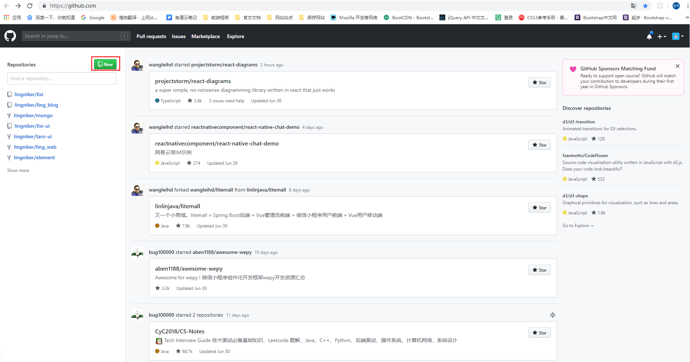

# git 学习 [git官网](https://github.com/)

1. 注册 登录 github (这没什么可说的)

2. 创建一个仓库 点击 new 

  

给仓库起一个名字,给个描述,是否是公开的,私人的需要付费。
  
   

## 创建了 github 之后，

// git 命令大全
// https://github.com/michaelliao/learngit/blob/master/2019-03/AlexSunShineZhou.md

// git 版本库是不是可已将多人带入进来。
// git fork 请求自己的路径
// git 使用的手册,是什么呢。
// 还有就是将其他人 拉近来有什么用呢。权限的控制。
// 版本的控制,主要的流程还会不知道啊.

```shell
   git clone https://github.com/lingniker/lixi.git //这里是你仓库的地址 将项目下载到本地里 
   cd lixi // 进入到你的仓库中
   git status // 查看库的状态
   git add . // 将所有的修改 条件到暂存区里
   git commit -m 'commit' // 将库由暂存区 提交到本地主干上
   git push // 将库提交到线上
   git check // 切换分支本地没有分支。若果是公开的仓库的话没有必要去创建分支，分支自有你自己知道。
   git merge // 合并分支
   git checkout // 切换分支
   git reset // 版本的回退
   git revert // 版本的回退
   git log // 提交的日记
```

```js
   git init file  // 初始化一个仓库 
```

```js
  git config --global user.name 'lingniker' // 谁是这样库
  git config --global user.mail 'lingyuanping@outlook.com' // 你的邮箱
```

```js
  git status // 查看暂存区 暂存区有三个转态。文件未添加,文件添加中，文件未添加, 如下图一所示 
  git add .  // 将所有的文件添加到暂存区中 文件进入padding 转态 如图二 所示
  git commit -m 'update' // 将暂存架上的添加到库中， 每次commit,都会生成 一个 哈希。 -m 'update' 是描述 这次的提交。方便日后查看的时候干了什么。提交完成之后就回退的了第一个转态，未改变转态
```

